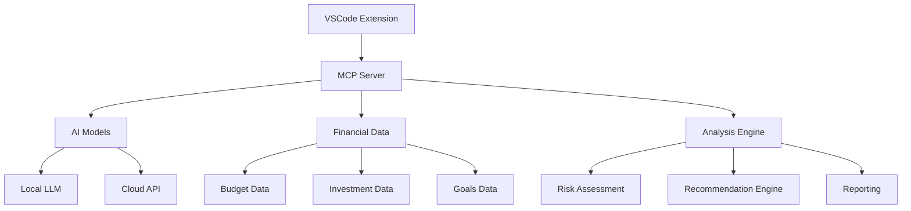

# Financial Advisor 💰

[](https://github.com/plures/FinancialAdvisor/actions/workflows/ci.yml)
[](https://github.com/plures/FinancialAdvisor/actions/workflows/security.yml)
[](https://opensource.org/licenses/MIT)
[](https://marketplace.visualstudio.com/items?itemName=plures.financial-advisor)
[](https://github.com/plures/FinancialAdvisor/releases)
[](https://codecov.io/gh/plures/FinancialAdvisor)

> Personal AI Financial Advisor - A VSCode extension with MCP server integration for intelligent financial guidance

## ✨ Features

- 🤖 **AI-Powered Financial Advice**: Leverage local or cloud AI models through MCP protocol
- 📊 **Budget Management**: Track and analyze your spending patterns
- 💡 **Investment Recommendations**: Get personalized investment suggestions
- 🎯 **Goal Setting**: Set and monitor financial goals with AI assistance
- 🔒 **Local-First Privacy**: Your financial data stays on your machine
- 🔌 **MCP Integration**: Extensible through Model Context Protocol

## 🏗️ Architecture



## 🚀 Quick Start

### Prerequisites

- Node.js 18+ 
- VS Code 1.85+
- Git

### Installation

```bash
# Clone the repository
git clone https://github.com/plures/FinancialAdvisor.git
cd FinancialAdvisor

# Install dependencies and setup
npm run bootstrap

# Package the extension
npm run package
```

### From VS Code Marketplace

1. Open VS Code
2. Go to Extensions (Ctrl+Shift+X)
3. Search for "Financial Advisor"
4. Click Install

## 🛠️ Development

### Setup Development Environment

```bash
# One-command setup
make bootstrap

# Or manually:
npm install
npm run setup:hooks
npm run build
npm run test
```

### Available Commands

```bash
# Development
make build          # Build the project
make watch          # Watch for changes
make test           # Run all tests
make lint           # Run linting
make format         # Format code

# Quality checks
make check-all      # Run all quality checks
make coverage       # Generate coverage report
make audit          # Security audit

# Package & Release
make package        # Create VSIX package
make release-check  # Check release readiness
```

### Project Structure

```
├── src/
│   ├── extension/          # VSCode extension code
│   │   ├── providers/      # Financial advice providers
│   │   └── mcp/           # MCP server integration
│   ├── mcp-server/        # MCP server implementation
│   └── shared/            # Shared types and utilities
├── test/
│   ├── unit/              # Unit tests
│   └── integration/       # Integration tests
├── .github/
│   ├── workflows/         # CI/CD pipelines
│   └── ISSUE_TEMPLATE/    # Issue templates
└── docs/                  # Documentation
```

## 🧪 Testing

```bash
# Run all tests
npm test

# Run specific test suites
npm run test:unit
npm run test:integration

# With coverage
npm run coverage
```

## 📦 Building & Packaging

```bash
# Build TypeScript
npm run build

# Package extension
npm run package

# Publish (requires tokens)
npm run publish
```

## 🔧 Configuration

### MCP Server Configuration

Create a `.financial-advisor-config.json` file:

```json
{
  "aiModel": {
    "provider": "local",
    "model": "llama3",
    "endpoint": "http://localhost:11434"
  },
  "privacy": {
    "localOnly": true,
    "encryptData": true
  },
  "features": {
    "budgetTracking": true,
    "investmentAdvice": true,
    "goalSetting": true
  }
}
```

### VS Code Settings

```json
{
  "financialAdvisor.autoStart": true,
  "financialAdvisor.notifications": true,
  "financialAdvisor.dataPath": "./financial-data"
}
```

## 🔒 Security & Privacy

- **Local-First**: Financial data never leaves your machine by default
- **Encryption**: Sensitive data is encrypted at rest
- **Audit Trail**: All operations are logged for transparency
- **No Telemetry**: No usage data is collected without explicit consent

### Security Features

- 🔐 End-to-end encryption for financial data
- 🛡️ Regular security scans (CodeQL, OSV)
- 🔍 Dependency vulnerability monitoring
- 📋 SBOM generation for supply chain transparency

## 🤝 Contributing

We welcome contributions! Please see our [Contributing Guide](CONTRIBUTING.md) for details.

### Development Workflow

1. Fork the repository
2. Create a feature branch: `git checkout -b feature/amazing-feature`
3. Make changes and add tests
4. Run quality checks: `make check-all`
5. Commit changes: `git commit -m 'feat: add amazing feature'`
6. Push to branch: `git push origin feature/amazing-feature`
7. Open a Pull Request

### Code Style

- TypeScript with strict mode
- ESLint + Prettier for formatting
- Conventional Commits for commit messages
- 80%+ test coverage requirement

## 📖 Documentation

- [API Documentation](docs/api.md)
- [Architecture Decisions](docs/adr/)
- [User Guide](docs/user-guide.md)
- [Developer Guide](docs/developer-guide.md)
- [Security Guide](docs/security.md)

## 🗺️ Roadmap

### Phase 1: Core Features ✅
- [x] VSCode extension framework
- [x] MCP server integration
- [x] Basic financial types
- [x] CI/CD pipeline

### Phase 2: AI Integration
- [ ] Local LLM integration (Ollama)
- [ ] Cloud AI API support
- [ ] Natural language financial queries
- [ ] Intelligent recommendations

### Phase 3: Advanced Features
- [ ] Real-time market data
- [ ] Investment portfolio tracking
- [ ] Tax optimization suggestions
- [ ] Risk assessment models

### Phase 4: Mobile & Web
- [ ] React Native mobile app
- [ ] Web interface
- [ ] Cross-platform sync
- [ ] API gateway

## 📊 Metrics & Analytics

- Code Coverage: 
- Build Status: [](https://github.com/plures/FinancialAdvisor/actions)
- Security Score: [](https://github.com/plures/FinancialAdvisor/actions)

## 🆘 Support

- 📋 [Issues](https://github.com/plures/FinancialAdvisor/issues)
- 💬 [Discussions](https://github.com/plures/FinancialAdvisor/discussions)
- 📧 Email: support@financial-advisor.dev
- 📚 [Documentation](https://docs.financial-advisor.dev)

## 📄 License

This project is licensed under the MIT License - see the [LICENSE](LICENSE) file for details.

## 🙏 Acknowledgments

- [Model Context Protocol](https://modelcontextprotocol.io/) for the MCP specification
- [VS Code Extension API](https://code.visualstudio.com/api) for the extension framework
- Open source community for tools and libraries

---

**⚠️ Disclaimer**: This tool provides educational information and should not be considered as professional financial advice. Always consult with qualified financial advisors for important financial decisions.
